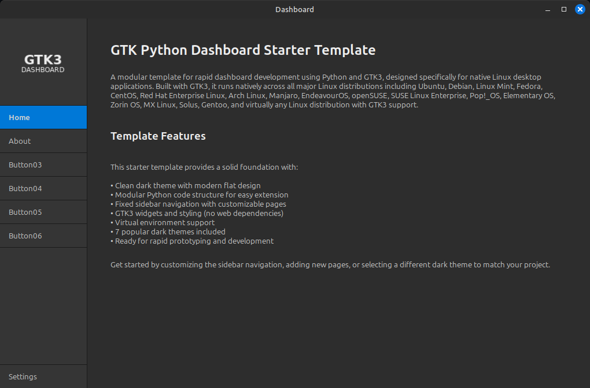

# GTK Python Dashboard Starter



A modular template for building GTK3 desktop applications using Python and PyGObject. This starter provides a clean foundation for rapid dashboard development on Linux systems.

## Features

- **Modern Dark Theme** - Flat design with custom CSS styling
- **Fixed Sidebar Navigation** - 150px wide sidebar with customizable buttons
- **Square Logo Area** - 150x150px perfectly sized for branding
- **Modular Python Structure** - Organized codebase for easy extension
- **No Web Dependencies** - Pure GTK3, no browser or web server needed
- **Virtual Environment Support** - Isolated Python dependencies
- **Ready to Customize** - Add pages, change colors, extend functionality

## Project Structure

```
gtk-python-dashboard-starter/
├── src/                     # Python source code
│   ├── main.py              # Application entry point
│   ├── ui/                  # UI components
│   │   ├── dashboard_window.py
│   │   ├── sidebar.py
│   │   └── content_area.py
│   ├── modules/             # Feature modules
│   └── utils/               # Utility functions
├── resources/               # Static resources
│   ├── css/                 # GTK CSS stylesheets
│   │   └── style.css
│   └── images/              # Images and icons
│       ├── logo.png
│       └── dashboard.png
├── requirements.txt         # Python dependencies
├── setup.py                 # Installation script
├── run.sh                   # Quick launch script
└── README.md                # This file
```

## Installation

### System Dependencies (Debian/Ubuntu)

```bash
sudo apt-get update
sudo apt-get install python3 python3-pip python3-gi python3-gi-cairo gir1.2-gtk-3.0
```

### Python Dependencies

```bash
# Create virtual environment (recommended)
python3 -m venv venv
source venv/bin/activate

# Install dependencies
pip install -r requirements.txt
```

## Running the Application

### Quick Start

```bash
./run.sh
```

### Or run directly

```bash
python3 src/main.py
```

### With virtual environment

```bash
source venv/bin/activate
python3 src/main.py
```

## Customization

### Add New Pages

Edit `src/ui/content_area.py` to add new pages to the stack.

### Modify Sidebar Navigation

Edit `src/ui/sidebar.py` to change button labels or add new navigation items.

### Change Colors

Edit `resources/css/style.css` to customize the color scheme. Key colors:
- Window Background: `#2d2d2d`
- Sidebar: `#353535`
- Active Button: `#0078D7`
- Text: `#eeeeee`

### Replace Logo

Replace `resources/images/logo.png` with your own 150x150px image.

## Color Scheme

| Component | Color Code | Description |
|-----------|------------|-------------|
| Window Background | #2d2d2d | Darker gray |
| Sidebar Background | #353535 | Dark gray |
| Logo Area | #3a3a3a | Medium dark gray |
| Active Button | #0078D7 | Windows blue |
| Button Hover | #404040 | Medium gray |
| Text (main) | #eeeeee | Off-white |
| Text (secondary) | #d0d0d0 | Light gray |
| Primary Accent | #0078D7 | Windows blue |
| Borders | #1a1a1a | Almost black |

## Technical Specifications

- **GTK Version**: GTK+ 3.0
- **Python**: 3.8+
- **Dependencies**: PyGObject, pycairo
- **Sidebar Width**: 150px
- **Logo Area**: 150x150px (square)
- **Button Height**: 28px
- **Theme**: Custom dark flat theme

## GTK Resources

- [GTK Documentation](https://docs.gtk.org)
- [PyGObject Documentation](https://pygobject.readthedocs.io)
- [GNOME Developer Center](https://developer.gnome.org)
- [Awesome GTK Apps](https://github.com/valpackett/awesome-gtk)

## License

Free for personal, educational, and non-commercial use.

Commercial use requires explicit written permission from the author.

## Contributing

Issues and pull requests welcome. Please ensure code follows the existing style and structure.

## About

This template was created to provide a solid foundation for Python GTK3 desktop applications. It emphasizes clean code structure, modern design, and ease of customization.
